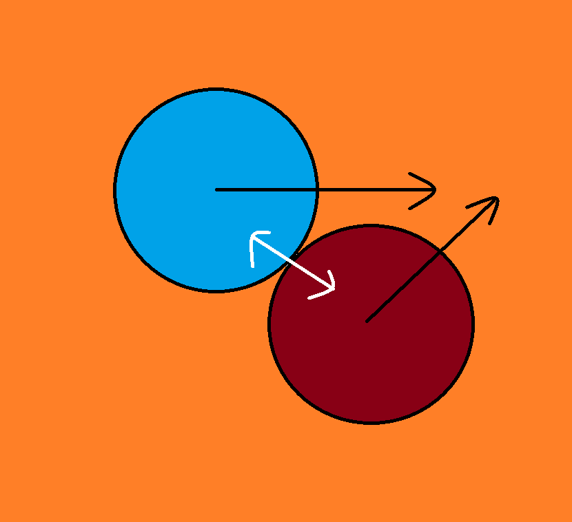
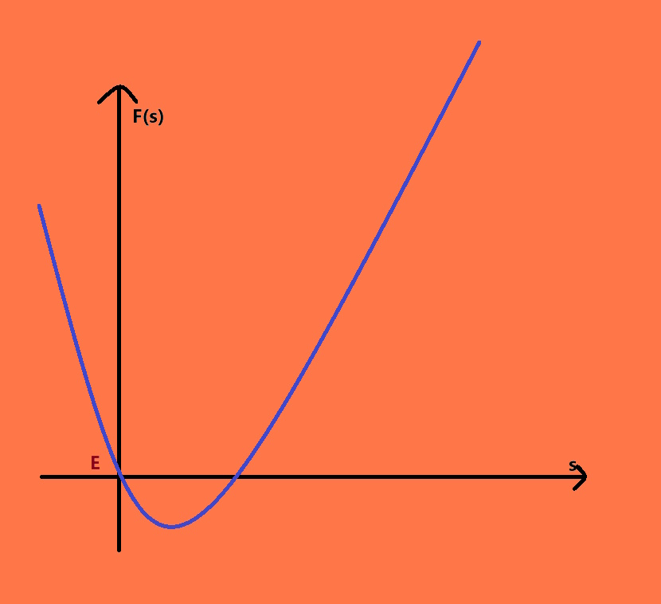
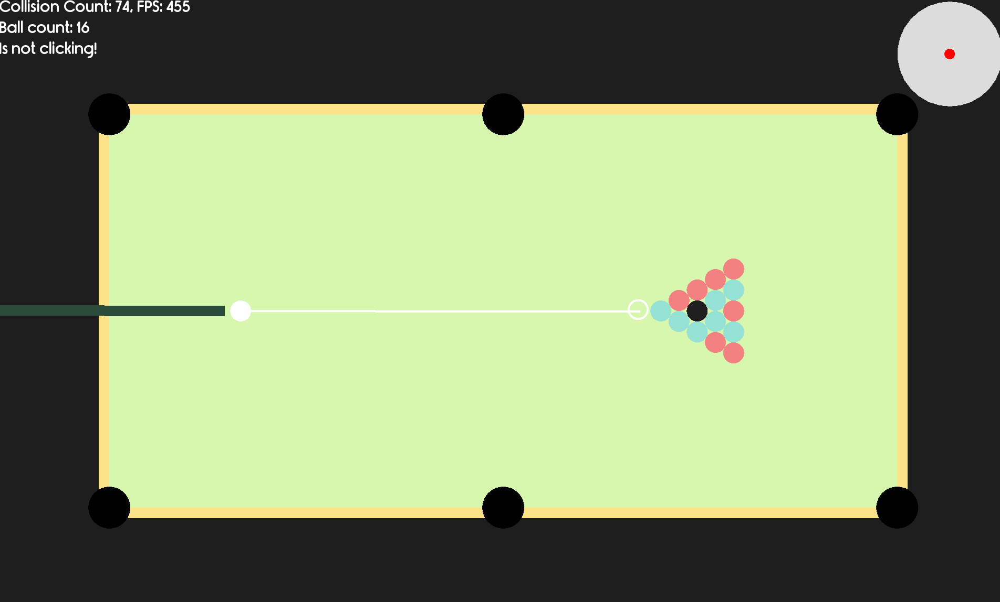

# How did I modeled billiard game

### 0. Opening

I'm kinda on a streak to shitpost right now, so let's get to it.

I've spent more time than I would like to admit on the physics part of this project. But in the end, I think it was pretty fun trying to grasp concepts that is very uncomfortable to think about. I'm pretty proud of the fact that I didn't use LLM assistance on any of my (shitpost) projects so far.

I wrote my thought process here to partly communicate to my future self what I was doing, partly to immortalize this piece of crap (I am kinda proud of this), and also for you guys to sit and read into what I was thinking. I hope you enjoy this draft as well as I have been enjoying thinking about this physics problem.

### 1. Elastic 1D collision

Now, we are dealing with a simplified version of the problem:

- On a straight line, there is a ball of mass $m_1$ and velocity $v_1$ collide with a ball of mass $m_2$ and velocity $v_2$. What are their final velocity after the collision, assuming the collision was perfectly elastic?

An elastic collision means that the total momentum and the total kinetic energy of the system are the same.

In other word:

$$
\begin{aligned}
m_1 * v_1 + m_2 * v_2 &= C \\
m_1 * v_1^2 + m_2 * v_2^2 &= D 
\end{aligned}
$$

With $C$ and $D$ be some constant.

We can solve this system of equation by substituting $v_2$ for $v_1$ and solve the quadratic formula. However, we don't actually need to, because we already have a solution, which is our initial set of speed.

With a few lines of reasoning of algebra (taking advantage of the fact that in the quadratic formula $ax^2 + bx + c = 0$, the sum of the two solution would be $-\frac{b}{a}$), we know that:


$$
\begin{aligned}
S &= 2 * \frac{m_1 * v_1 + m_2 * v_2}{m_1 + m_2}\\
v_3 &= S - v_1 \\
v_4 &= S - v_2
\end{aligned}
$$

That's actually pretty clean! With this alone, we can already do some pretty interesting experiment, such as computing PI using colliding objects:

[](https://www.youtube.com/watch?v=HEfHFsfGXjs)


### 2. Elastic 2D collision

The same as the last problem, but now, two object are colliding in 2D space. The math become much harder, because not only we have to somehow compute the final velocity such that they make sense, the total amount of momentum and kinetic energy is conserved, and the velocity vector has to change by a multiple of the normal force as well.



*Figure 1: Two balls are colliding. As you can see, they have their own velocity, but the only force that are changing the balls' movement are the normal force.*

We can still make quadratic formula like in the last part. However, I would like something that is easier to think about, harder to mess up, and still have great accuracy. 

Let's look at the system of equation again.

$$
\begin{aligned}
m_1 * v_{x_1} + m_2 * v_{x_2} &= C \\
m_1 * v_{y_1} + m_2 * v_{y_2} &= D \\
F(s) = m_1 * v_1^2 + m_2 * v_2^2 &= E
\end{aligned}
$$

Our job is to find a perfect scaling $s$ for the normal vector, such that when both of the ball velocity are changed by that normal vector (scaled up and down depending on the mass), they will still be a valid solution of the system of equation.

Noticed how our target function $F(s)$ is a positive quadratic function. Which means the outcome for each $s$ would look like this:



*Figure 2: The function F(s). The horizontal line is y = E.*

Because $s = 0$ is already a solution of the equation $F(s) = E$, we only need to find the other solution by binary searching for the smallest point such that $F(s) \geq E$.

Code:

```cpp

void collision(Entity& o1, Entity& o2) {
	Point2 diff = (o1.u - o2.u).normalized();
	float kin = o1.get_kinetic_energy() + o2.get_kinetic_energy();
	float weight_diff = o1.m / o2.m;
		
	float l = 0.01, r = 4000;
	for (int it = 0; it < 100; ++it) {
		float mid = (l + r) / 2;
		Entity o3 = o1, o4 = o2;
		o3.v += diff * mid;
		o4.v -= diff * mid * weight_diff;

		if (o3.get_kinetic_energy() + o4.get_kinetic_energy() <= kin) l = mid;
		else r = mid;
	}
	o1.v += diff * l;
	o2.v -= diff * l * weight_diff;
}
```

With a bit more coding, we already have ourselves a billiard table (note that we are only dealing with, at best, 16 balls, so optimized collision checking algorithms are not needed)! This is actually kind of playable.



*Figure 3: A pool table.*

To calculate the strength of our stroke, we simply just have to calculate the dot product between:
- The normalized distance between the initial mouse position and the cue ball.
- The distance between the initial mouse position and the final mouse position after releasing.

We have an almost complete game. But there is a missing flavor: Spin. 

### 3. Spin

Oh boy, spin is so complex and gave me so much headache. And that is when I learn something when it comes to physics simulation: Just make assumption!

In contrary to object collision, spin is harder to implement, but also harder to notice something was wrong. So, my job is to make a convincing physics model that doesn't require 4 years of undergraduate education in Waterloo. Here are my assumptions:
- There are three plane of spin: X, Y, Z. (X and Y is the spin on the table, while Z is the side spin.)
- We can separate them.
- Friction will turn translational velocity to rotational velocity and vice versa.
- Rotational velocity and translational velocity will be diminished by the friction force without any consequence.
- Only side spin (Z) get translated when colliding with other balls and with a rails. Spin in the X and Y direction will not get translated (They can be turned into Z-spin as well if they do get translated, which is fucking disgusting).

With these assumption in mind, let's build our own billiard model!

As usual, we will also solve the 1D problem first.

For each object, there would be two vector: translational vector and rotational vector. Simply put, translational vector is how fast the object is moving, and rotational vector is how fast the object will move if it obey the spin completely.

For example: $\vec T = 5$ and $\vec R = 0$ means the object is moving without spinning (skidding), $\vec T = 0$ and $\vec R = 5$ means the object is spinning without moving (slipping), $\vec T = 3$ and $\vec R = 3$ means it's a normal rolling object, which is ideal and is what the physics want.

In the case where $\vec R \neq \vec T$, the friction force will turn translational velocity into rotational velocity or vice versa so that these two are equal again. 

We can easily expand this into 2D:

```cpp
void Entity::progress(float delta, bool has_friction) {
	u += v * delta;
	if (!has_friction) return;

	// correcting translational and rotational energy, so that they are getting closer to each other
	if ((v - r).length() > 0) {
		float v1 = (v - r).length() * 0.5f, v2 = ROLL_MU * delta;
		float len = std::min(v1, v2);
		Point2 diff = (v - r).normalized() * len;
		r += diff;
		v -= diff;
	}
}
```

We have to take into account that our rotational and translational velocity will lose to time due to the friction force, so we will also implement that:

```cpp
void disperse(Point2 &v, float F) {
	float len = v.length();
	if (len <= F) {
		v = Point2(0, 0);
	}
	else {
		v -= v.normalized() * F;
	}
}
```

Our model is almost complete, and we now have topspin and backspin in our billiard game, which is very fun to mess around with. Now we are going to implement side spin, which are only going to be there for the purpose of interacting with rails.

We just have to add another attribute $r_z$, and when we collide with other object, $r_z$ will be distributed between them. 

```cpp
float half_spin = (o1.r_z * o1.m + o2.r_z * o2.m) / (o1.m + o2.m);
o1.r_z -= half_spin * o1.m;
o2.r_z -= half_spin * o2.m;
```

When an object collide with a rail, half of the side spin will get converted into translational energy as well:

```cpp
int cur = check_collide_edge(o1, delta);
float amount = o1.r_z * 0.5f;
o1.r_z *= 0.5f;
if (GETBIT(cur, 0)) { // collide with vertical rail
	if (o1.v.x > 0) 
		o1.v.y += amount;
	else o1.v.y -= amount;
	o1.v.x *= -1;
}
if (GETBIT(cur, 1)) { // collide with horizontal rail
	if (o1.v.y > 0)
		o1.v.x -= amount;
	else o1.v.x += amount;
	o1.v.y *= -1;
}
```

There is still a bit of tweaking, such as atjusting the translational friction, rolling friction and sidespin friction, as well as making the object's velocity diminish after each collision. However, they aren't the most exciting thing in the world so I won't list them here. You guys should be pretty familiar with the SWEs portion of this game.

### 4. Epilogue

I finished this project in around 2 days, and I think I learned a lot from playing around with physics. Now it's 2:16 AM, and I can finally rest.